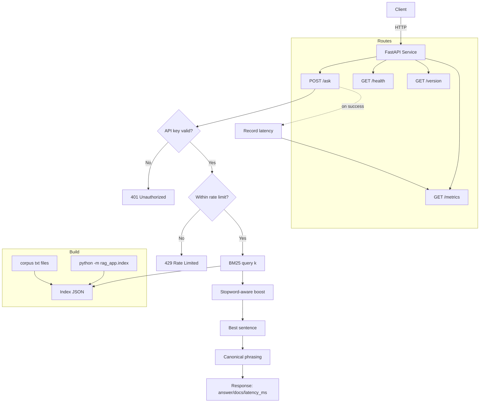

# Production RAG Service — Starter Kit


[](https://github.com/KyleSDeveloper/rag_service/actions/workflows/ci.yml)

Hybrid retrieval (BM25 baseline today; vectors/reranking optional) with evals, auth, rate limiting, and latency metrics.

## Table of Contents
- [Acceptance Criteria](#acceptance-criteria-edit-targets-as-needed)
- [Quickstart](#quickstart)
- [Endpoints](#endpoints)
- [Usage (auth required)](#usage-auth-required)
- [Evaluate](#evaluate)
- [Benchmarks (local demo)](#benchmarks-local-demo)
- [Architecture](#architecture)
- [Deployment (Docker & one-click)](#deployment-docker--one-click)
- [Monitoring & Metrics](#monitoring--metrics)
- [Security (API key & rate limiting)](#security-api-key--rate-limiting)
- [Troubleshooting](#troubleshooting)
- [Notes](#notes)


## Acceptance Criteria (edit targets as needed)
- Recall@10 ≥ 0.80; Answer F1 ≥ 0.70 (or EM ≥ 0.60)
- p95 latency ≤ 800 ms (≥100 queries); p50 ≤ 300 ms
- Cost/1k queries within budget; cache hit-rate ≥ 30%
- API-key auth + rate limiting
- Docker + one-click deploy (Render/Fly/Cloud Run)
- README benchmarks table + Loom demo

## Quickstart

### Option A — conda
```bash
conda create -n rag_env python=3.11 -y
conda activate rag_env
pip install -r requirements.txt

# build the BM25 index
python -m rag_app.index --corpus ./corpus --out ./rag_app/index.json

# run (auth + rate limit)
API_KEY=dev-key RATE_LIMIT_PER_MIN=30 \
python -m uvicorn rag_app.main:app --host 0.0.0.0 --port 8010
```

### Option B — venv
```bash
python -m venv .venv && source .venv/bin/activate
pip install -r requirements.txt

# build the BM25 index
python -m rag_app.index --corpus ./corpus --out ./rag_app/index.json

# run (auth + rate limit)
API_KEY=dev-key RATE_LIMIT_PER_MIN=30 \
uvicorn rag_app.main:app --host 0.0.0.0 --port 8010
```

### One-liner — build index & run
```bash
API_KEY=dev-key RATE_LIMIT_PER_MIN=30 \
python -m rag_app.index --corpus ./corpus --out ./rag_app/index.json && \
python -m uvicorn rag_app.main:app --host 0.0.0.0 --port 8010
```

## Endpoints
- `GET /health`   → `{"ok": true, "version": "..." }`
- `GET /version`  → `{"version": "..." }`
- `GET /metrics`  → `{"requests": n, "latency_ms_p50": ..., "latency_ms_p95": ..., "window": n}`
- `POST /ask`     → `{ "answer": "...", "latency_ms": 0.0, "docs": [ { "doc_id": "...", "text": "...", "score": ... } ] }`

## Usage (auth required)

Set your base URL and API key (local example shown):
```bash
export BASE_URL=http://localhost:8010
export API_KEY=dev-key
```

**Authorized request (200):**
```bash
curl -s -X POST "$BASE_URL/ask" \
  -H "x-api-key: $API_KEY" -H "Content-Type: application/json" \
  -d '{"question":"What is coinsurance?","k":5}' | python -m json.tool
```

**Unauthorized example (should be 401):**
```bash
curl -i -s -X POST "$BASE_URL/ask" \
  -H "Content-Type: application/json" \
  -d '{"question":"What is coinsurance?","k":5}'
```

**Metrics:**
```bash
curl -s "$BASE_URL/metrics" | python -m json.tool
```

## Evaluate
Place 50 Q/A pairs in `eval/gold.jsonl`:
```json
{"question":"...", "answer":"..."}
```
Run the evaluator:
```bash
python -m eval.evaluate --gold ./eval/gold.jsonl --api http://localhost:8010/ask --k 5
```

## Benchmarks (local demo)
<!-- METRICS:BEGIN -->
| Metric      | Value            |
|-------------|------------------|
| Answer F1   | 1.00 (toy)       |
| Recall@10   | 1.00 (toy)       |
| p50 latency | 0.199 ms (local) |
| p95 latency | 0.355 ms (local) |
<!-- METRICS:END -->

## Architecture



### Components
- **API layer:** `rag_app/main.py` (FastAPI app, routes, request/response models).
- **Auth:** Simple API-key via `x-api-key` header. Disabled if `API_KEY` env is unset/empty.
- **Rate limiting:** In-memory token bucket per key (`RATE_LIMIT_PER_MIN`), thread-safe.
- **Retrieval:** `rag_app/retrieval.py` with `BM25Retriever` over a JSON index.
- **Index build:** `rag_app/index.py` splits `corpus/*.txt` into snippets → writes `rag_app/index.json`.
- **Answering:** Stopword-aware boost, choose best sentence from top snippet, then optional **canonical** phrasing for known intents.
- **Metrics:** In-memory deque of recent latencies (p50/p95) + request count, exposed at `/metrics`.
- **(Optional) Cache:** Small in-memory LRU for repeated `(question,k)` lookups.

### Request lifecycle (`POST /ask`)
1. **Guard**: Check `x-api-key` (if `API_KEY` is set) and **rate limit** the caller.
2. **Retrieve**: Query BM25 over `rag_app/index.json` (top-k).
3. **Re-rank**: Apply stopword-aware term-match **boost** to prioritize relevant snippets.
4. **Answer pick**: Choose the **best sentence** from the top snippet; if the question matches a known intent, apply **canonical phrasing**.
5. **Metrics**: Record latency (ms) into a rolling window (default 5k requests).
6. **Respond**: Return `{answer, latency_ms, docs}`.

### Data & storage
- **Corpus**: Plain text files under `corpus/`. Edit or replace for your domain.
- **Index artifact**: `rag_app/index.json` (generated). Treat as a **build artifact**; ignore in git.
  - Build at image build time (Docker) or at container start if missing.

### Configuration (env)
- `API_KEY` – enables auth when set (e.g., `dev-key` for local).
- `RATE_LIMIT_PER_MIN` – integer per-key budget (default `60`).
- *(If you add caching)* `CACHE_TTL_S`, `CACHE_MAX`.

### Module layout (key files)
```text
rag_app/
├─ main.py         # FastAPI app, routes, auth, limiter, metrics, answering
├─ retrieval.py    # BM25Retriever (loads/snaps index)
├─ index.py        # builds JSON index from corpus/*.txt
└─ index.json      # generated artifact (ignored in VCS)
eval/
└─ evaluate.py     # computes F1/Recall@k via API calls
corpus/
└─ *.txt           # domain text
```

## Deployment (Docker & one-click)

### One-click (Render)
[](https://render.com/deploy)

> Uses Dockerfile. Set `API_KEY` in Render env vars after deploy.


### Docker (local)
```bash
# build
docker build -t rag-service .

# run (maps 8000->8000 in the container)
docker run --rm -p 8000:8000 \
  -e API_KEY=dev-key \
  -e RATE_LIMIT_PER_MIN=60 \
  rag-service
```

Set `BASE_URL=http://localhost:8000` when testing the container.

## Monitoring & Metrics

### What’s exposed
- `GET /metrics` → JSON:
  ```json
  {
    "requests": 42,
    "latency_ms_p50": 1.23,
    "latency_ms_p95": 3.45,
    "window": 42,
    "version": "..."
  }
  ```
- `window` = number of recent requests kept in memory (rolling window).
- Values reset on process restart (in-memory).

### Quick checks
```bash
# Pretty print
curl -s "$BASE_URL/metrics" | python -m json.tool

# Print just key numbers (quote-safe)
curl -s "$BASE_URL/metrics" \
| python -c 'import sys,json; d=json.load(sys.stdin); print("requests={}  p50={} ms  p95={} ms".format(d["requests"], d["latency_ms_p50"], d["latency_ms_p95"]))'
```

### Optional: Prometheus endpoint
```bash
pip install prometheus-fastapi-instrumentator
```
```python
# rag_app/main.py
from prometheus_fastapi_instrumentator import Instrumentator

@app.on_event("startup")
def _startup():
    Instrumentator().instrument(app).expose(app, endpoint="/metrics/prom")
```

## Security (API key & rate limiting)

### API key
- Header: `x-api-key: <YOUR_KEY>`
- Enabled when `API_KEY` env var is **set** (any non-empty string).
- Disabled in dev if `API_KEY` is empty.

**Examples**
```bash
# Authorized (200)
curl -s -X POST "$BASE_URL/ask" \
  -H "x-api-key: $API_KEY" -H "Content-Type: application/json" \
  -d '{"question":"What is coinsurance?","k":5}'

# Unauthorized (401)
curl -i -s -X POST "$BASE_URL/ask" \
  -H "Content-Type: application/json" \
  -d '{"question":"What is coinsurance?","k":5}'
```

### Rate limiting
- In-memory **token bucket** per API key.
- Budget per minute: `RATE_LIMIT_PER_MIN` (default **60**).
- Exceeds budget → **429 Too Many Requests**.
- For multi-replica deployments, move buckets to Redis (shared state).

**Set limits**
```bash
API_KEY=<strong-secret> RATE_LIMIT_PER_MIN=60 \
uvicorn rag_app.main:app --host 0.0.0.0 --port 8010
```

**Best practices**
- Use different keys per environment (dev/stage/prod).
- Rotate keys; never commit them.
- Front with a gateway/WAF if exposed publicly.
- Add CORS policy if you’ll call from a browser app.

## Troubleshooting

| Symptom | Likely cause | Fix |
|---|---|---|
| `401 Unauthorized` on `/ask` | Missing/incorrect `x-api-key` or `API_KEY` not set on server | Set `API_KEY` server-side and send `x-api-key` header. Test `curl -s $BASE_URL/health`. |
| `429 Too Many Requests` | Rate limit exceeded | Lower request rate, increase `RATE_LIMIT_PER_MIN`, or use separate keys for tests. |
| `404 Not Found` on `/version` or `/ask` | Wrong app path or port | Ensure you run `rag_app.main:app` and target the right port. List paths via `/openapi.json`. |
| Port already in use | Old server still running | `ss -lptn 'sport = :8010'` then kill the PID, or change `--port`. |
| `uvicorn: command not found` | Not installed in current env | `pip install uvicorn[standard]`; confirm with `which python` / `which uvicorn`. |
| `ModuleNotFoundError: rag_app` | Wrong cwd / PYTHONPATH | Run from repo root or set `PYTHONPATH=.`; `uvicorn rag_app.main:app ...`. |
| Index missing at startup | `rag_app/index.json` not built | Run `python -m rag_app.index --corpus ./corpus --out ./rag_app/index.json`. |
| `/metrics` shows zeros | Fresh process or no traffic | Send a few `/ask` requests, then recheck. |
| JSON errors in CLI snippets | F-string quoting | Use the `.format()` example in Monitoring section. |
| Docker healthcheck failing | Wrong port or env | Container listens on `$PORT` (default 8000). Map and set `API_KEY`. |

**Diagnostics**
```bash
# List routes
curl -s "$BASE_URL/openapi.json" | python -m json.tool

# Health/version
curl -s "$BASE_URL/health"; curl -s "$BASE_URL/version"

# Minimal POST
curl -s -X POST "$BASE_URL/ask" \
  -H "x-api-key: $API_KEY" -H "Content-Type: application/json" \
  -d '{"question":"What is coinsurance?","k":3}' | python -m json.tool
```

## Notes
- Start with BM25 baseline (rank_bm25), then add vectors + reranker as needed.
- Consider a small LRU cache for repeated queries and structured logging for observability.

## License
MIT — see [LICENSE](LICENSE).

## Contact
Questions? Open an issue or ping me on LinkedIn.


